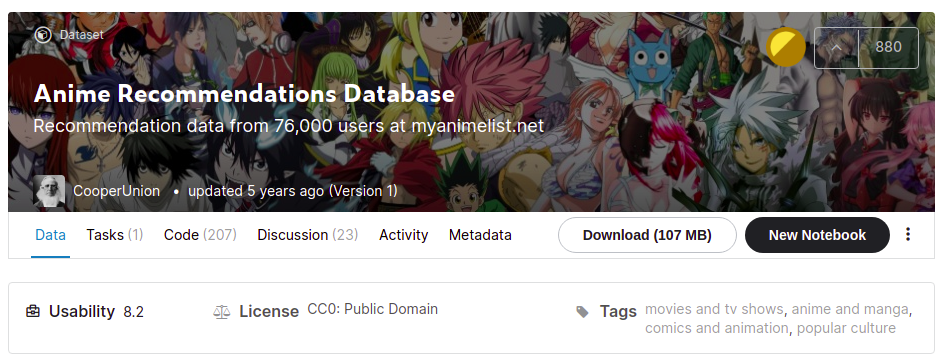

# Recommender System Project with Anime

This repository contains the implementation of various recommender system algorithms on Anime Dataset.

Currently contains:

1. Non-Personal Recommendations
2. Item-Item Nearest Neighbor Collaborative Filtering

Download the Dataset from [here](https://www.kaggle.com/CooperUnion/anime-recommendations-database)